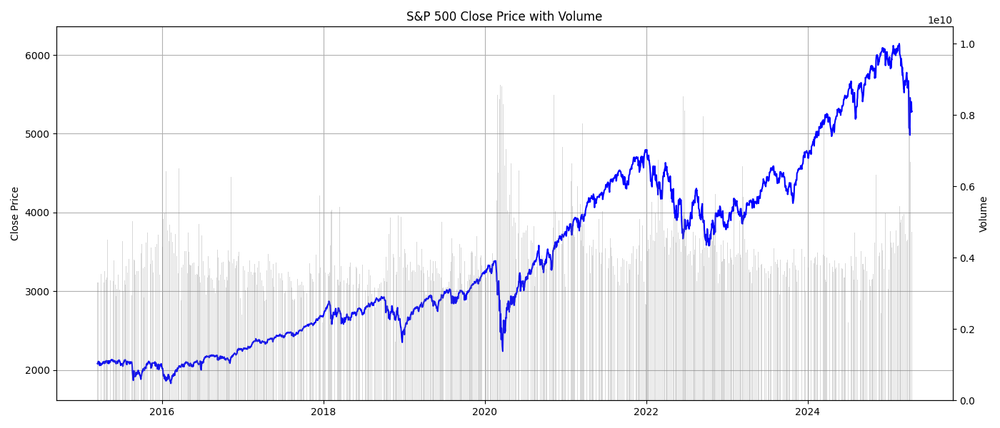
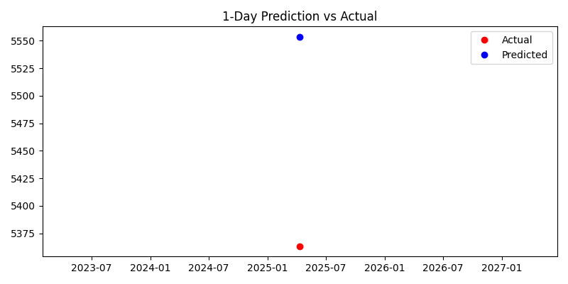

# sp500-lstm-forecasting
Multi-step LSTM forecasting model for the S&amp;P 500 using technical indicators and evaluation metrics like Sharpe Ratio, Drawdown, and Directional Accuracy.

# S&P 500 Forecaster with LSTM

🚀 A deep learning model that predicts 1-day and 5-day future prices of the S&P 500 using LSTM.  
📈 Includes technical indicators (MA50, RSI, MACD, Bollinger Bands, Volatility).  
📉 Evaluates with RMSE, Sharpe Ratio, Drawdown, and Directional Accuracy.  

## 🔍 Features
- Predict next 1 and 5 days of S&P 500 closing prices
- Visualize price vs volume and prediction vs actual
- Trainable LSTM model with PyTorch
- Daily update-ready with persistent CSV data
- Auto-calculated trading suggestions (Buy/Sell/Hold)

## 📊 Sample Outputs



For first time use, press 2, so it will train the model. After that, run again and press 1. You can also press 4 to evaluate the model.
The expected result you can see:
📊 RMSE: $279.91
📊 MAE:  $227.66
📈 R² Score: 0.8049
📉 Sharpe Ratio: 0.08
🔻 Max Drawdown: -9.16%

🎯 Directional Accuracy: 48.62%

Or if you predict the market, then:
--- Prediction ---
Current Price: $5282.70
Predicted Price (1d ahead): $5553.50
Predicted Price (5d ahead): $5442.73




## 📁 How to Run
```bash
python predict_sp500.py


